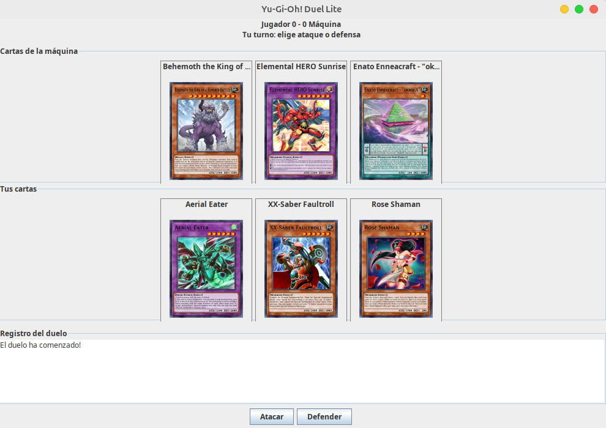
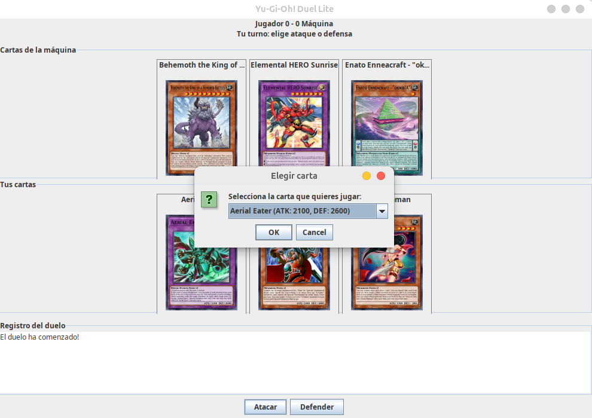
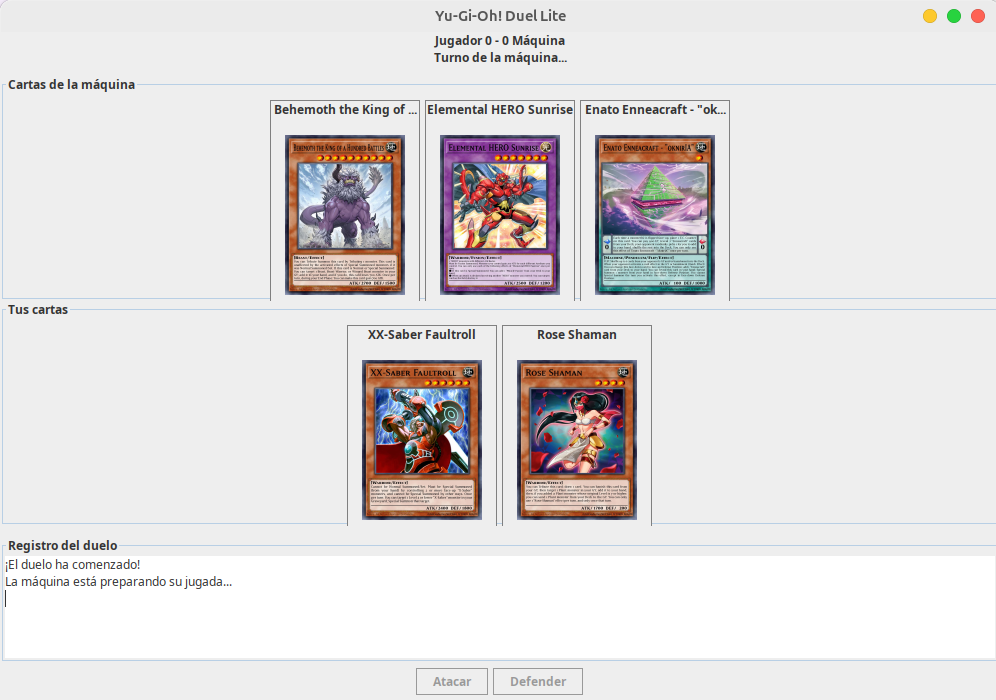

# Yu-Gi-Oh! Duel Lite

## Instrucciones de ejecución

Para ejecutar el proyecto es necesario tener instalado Java y Maven. El proyecto utiliza Java Swing para la interfaz gráfica y se conecta a la API de Yu-Gi-Oh! para obtener cartas aleatorias, por lo que se necesita conexión a internet durante la partida.

Para iniciar el juego, abre una terminal en la carpeta raíz del proyecto y ejecuta el siguiente comando:

```bash
mvn clean compile exec:java
```

Si el proyecto no tiene configurado el plugin de ejecución de Maven, también se puede abrir desde un IDE como IntelliJ IDEA y ejecutar la clase `Main.java`, ubicada en `src/main/java/co/edu/univalle/`.

Al iniciar, el juego carga las cartas del jugador y de la máquina. El jugador puede elegir si desea utilizar el ataque o la defensa de una carta para competir contra la carta seleccionada por la máquina. Los puntos se actualizan según el resultado de cada ronda y el duelo termina cuando uno de los participantes alcanza dos puntos o se agotan las cartas. Al finalizar, aparece una ventana que muestra el resultado y permite iniciar una nueva partida o cerrar el juego.

## Diseño del proyecto

El proyecto está organizado en paquetes para separar las responsabilidades de cada parte del programa. El paquete `model` contiene la clase `Card`, que representa las cartas y almacena sus datos principales, como el nombre, el ataque, la defensa y la imagen. El paquete `api` contiene `YgoApiClient`, encargado de realizar las peticiones a la API de Yu-Gi-Oh! y obtener la información de las cartas. Por su parte, el paquete `game` contiene la lógica del duelo, incluyendo los turnos, la comparación de las cartas y el marcador.

La interfaz gráfica se encuentra en el paquete `ui`, donde `DuelFrame` muestra las cartas, los botones y el resultado de la partida. Para mantener separada la lógica del juego de la interfaz, se utiliza la interfaz `BattleListener`, que permite notificar los cambios de turno, la actualización del marcador y el final del duelo. Finalmente, la clase `Main` se encarga de iniciar la aplicación. Esta organización facilita la comprensión del código y permite modificar la interfaz o la lógica del juego sin tener que cambiar todo el proyecto.

## Capturas de Pantalla


